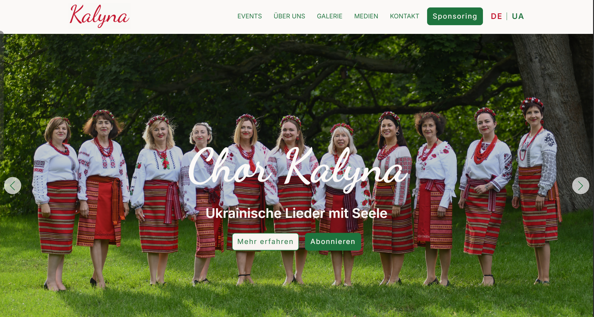

# Ukrainischer-Chor-Kalyna

### 👉 [Ukrainischer-Chor-Kalyna](https://chor-kalyna.com/)

### ✨ Overview

  

This is a comprehensive, multi-page, responsive website built for a professional choir. I acted as the sole developer and designer, taking the project from initial concept to a fully optimized production-ready site. Since the project lacked a dedicated designer, I was responsible for the entire visual language and user experience.

### 🚀 Key Features

- Custom UI/UX Design: Independently developed the visual concept, including color theory, typography, and layout.
- Multilingual Interface (i18n): Fully implemented dual-language support to cater to international audiences.
- Performance Focused: Optimized all media assets using modern WebP formats and lazy loading.
- Full Responsiveness: Ensures a seamless experience across all devices, from mobile phones to high-resolution monitors.
- Interactive UI Elements: Features a high-impact Hero slider and custom-built animations for the Media section.
- Conversion-Centric: Strategically designed sections for Newsletter subscriptions and Sponsorship opportunities.

### 🎯 Business Goals & Solutions (Product Mindset)

In this project, I bridged the gap between design and engineering to solve specific business needs:
- Brand Identity: Without a pre-existing brand book, I selected a font pairing and color palette that reflects the academic yet creative nature of the ensemble.
- User Journey: I designed the page structure with a focus on conversion, ensuring that CTAs (Call-to-Action) for sponsorships and subscriptions are placed logically within the user flow.
- Content Architecture: Developed a scalable multi-page structure, including specialized layouts for articles, a custom 404 page, and a dynamic media gallery.
- Modern Web Standards: Implemented semantic HTML5 and SEO best practices (meta tags, favicon) to ensure the site is discoverable and accessible.

### 🛠 Tech Stack
- Core: HTML5 (Semantic), CSS3 (Flexbox, Grid, Custom Animations), JavaScript (ES6+).
- Methodology: BEM (Block Element Modifier) for clean, maintainable CSS.
- Optimization: WebP image compression, responsive images (srcset), and cross-browser testing.
- Tools: Git/GitHub, VS Code.
